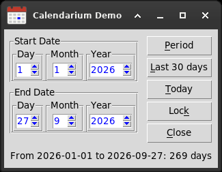

# Calendarium

**A date picker widget for Tkinter.** Day, month and year in three spinboxes,
validated as you type, with the result as a `datetime.date`. One Python file,
standard library only: copy it into your project and use it.



- **No dependencies** — `tkinter` and `datetime`, nothing to install.
- **One file** — `calendarium.py`, nothing else to carry around.
- **Keyboard first** — the operator types the date; no pop-up calendar to click through.
- **Digits only** — letters and signs are refused as they are typed.
- **A date or `None`** — never a half-valid value: 31 February is `None`.

## Requirements

Python 3.6 or later, with Tk. On Debian and Ubuntu Tk is a separate package:

```bash
sudo apt install python3-tk
```

## Installation

Copy `calendarium.py` next to your code. That is all.

## Usage

```python
import tkinter as tk
from calendarium import Calendarium

root = tk.Tk()

start_date = Calendarium(root, "Start Date")
start_date.pack(padx=8, pady=8)   # or .grid(row=0, column=0, sticky=tk.W)
start_date.set_today()

def on_save():
    if not start_date.is_valid:
        start_date.set_focus()
        return
    print(start_date.get_iso())   # "2026-09-27"

tk.Button(root, text="Save", command=on_save).pack(pady=8)
root.mainloop()
```

Use either `grid` or `pack` on the same parent, not both.

## Constructor

```python
Calendarium(parent, name, *, base_bg_color=None,
            year_from=datetime.MINYEAR, year_to=datetime.MAXYEAR, **kwargs)
```

| argument | meaning |
|---|---|
| `parent` | the parent widget |
| `name` | the caption of the frame, e.g. `"Start Date"`; `""` for none |
| `base_bg_color` | background, as `"#f0f0ed"` or `(240, 240, 237)`; an invalid colour falls back to the theme |
| `year_from`, `year_to` | the range of years accepted; outside it the date is not valid |
| `**kwargs` | passed on to `tk.LabelFrame` |

## Methods

| method | what it does |
|---|---|
| `set_today()` | set today's date |
| `set_date(date)` | set a `datetime.date` |
| `set_from_datetime(value)` | set from a `datetime.datetime` (the time is dropped) or a `date` |
| `set_days_ago(n)` | today minus `n` days |
| `set_days_ahead(n)` | today plus `n` days |
| `is_valid` | `True` if the three fields make a real date in range |
| `get_date()` | the `datetime.date`, or `None` if not valid |
| `get_iso()` | the date as `"YYYY-MM-DD"`, ready to store, or `None` |
| `get_timestamp()` | the date with the current time of day, or `None` |
| `set_state(state)` | `tk.NORMAL` or `tk.DISABLED`, for all three spinboxes |
| `set_focus()` | put the keyboard on the day |

**`is_valid` is a property: write it without parentheses.**
`if not start_date.is_valid:` is right. With parentheses Python raises
`TypeError: 'bool' object is not callable`.

The three fields are also available as `StringVar`s: `day`, `month`, `year`.

## Demo

```bash
python3 examples/demo.py
```

The period between two dates, using every part of the API. For a quick look at
the widget alone:

```bash
python3 calendarium.py
```

## Tests

Standard library `unittest`. From the root of the repository:

```bash
python3 -m unittest discover -s tests -v
```

Tk needs a display. Without one, run them under `xvfb-run -a`, otherwise they
are skipped.

## Repository layout

```
calendarium.py      the widget: the one file to copy
examples/demo.py    a small application that uses it
tests/              unit tests
tools/make_icon.py  draws the demo icon (needs Pillow, only to redraw it)
docs/               the screenshot
```

## License

MIT, see [LICENSE](LICENSE).

Author: Giuseppe Costanzi ([1966bc](https://github.com/1966bc)).
Calendarium is used in his laboratory applications, such as
[inventarium](https://github.com/1966bc/inventarium).

Calendarium is primitive, but it works and it's light.
